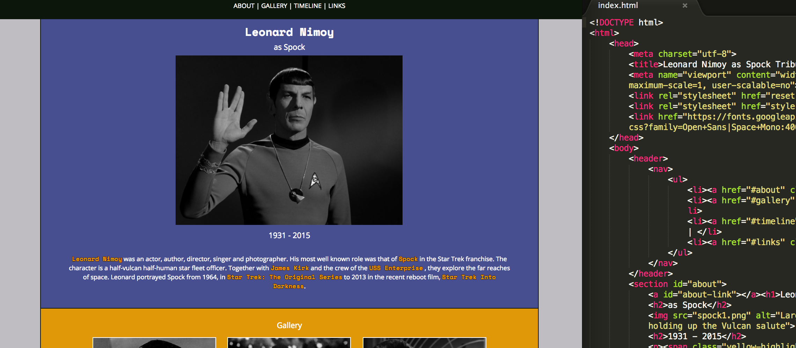
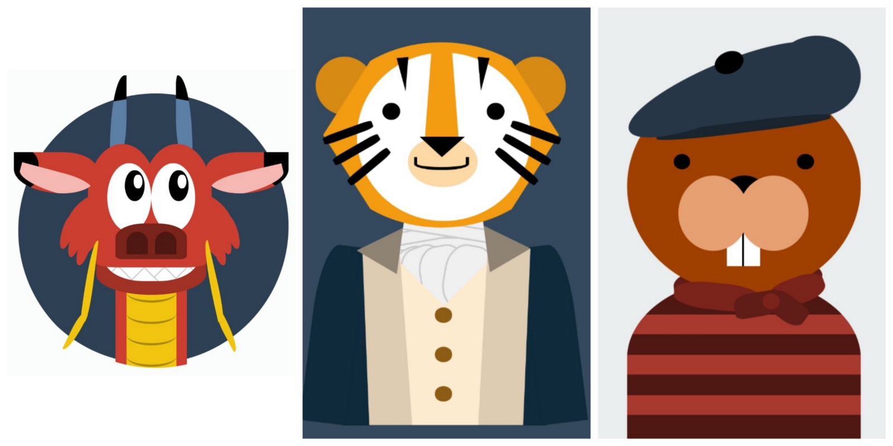
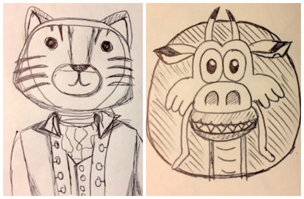
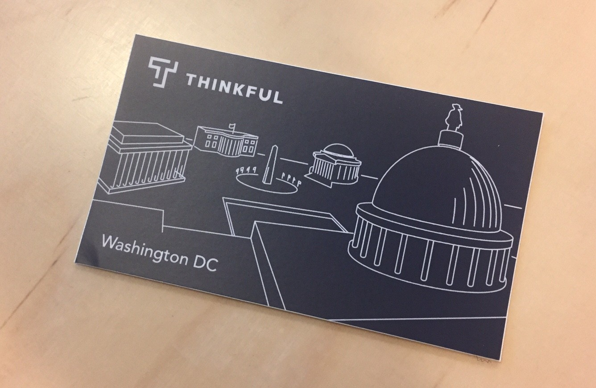

I am now in my second week of the 100 Days of Code Challenge. Below is a recap of everything that I accomplished during this past week.

> I created five CSS image, learned about responsive design techniques, finished up my Free Code Camp tribute page project, and attended Meetups.

### Projects

The majority of my coding this week was for the CSS Daily Image challenge as well as HTML and CSS exercises through Thinkful’s bootcamp prep course. I also have completed my Free Code Camp tribute page after making some minor updates.

**Daily CSS Images:**

Daily CSS Image is a fun challenge created by [Mike Mangialardi](https://twitter.com/michaelmangial1). Each weekday, you will be sent a prompt and in turn you create a CSS image. You can [sign up here](http://dailycssimages.com/).

It’s a great way to get more comfortable with CSS and as the week progressed, I found myself trying to learn new techniques so that I could make better images and write cleaner code. Eventually I will go back and improve the CSS for these projects. Below is the most recent CSS image that I created.

[Mushu Codepen Link](https://codepen.io/trekkiegirl/full/VPjGrL/) for ‘animated animal’ prompt.

[My Codepen Profile](https://codepen.io/trekkiegirl/pens/public/)

As always, all of the images started with quick sketches.

### Meetups

I attended two Meetups again this past week.

**Build a Game with Javascript (Thinkful DC)**

During this Meetup, we walked through building a simple guessing game using Javascript. This class was great because we were able to see how Javascript could be used with a website in conjunction with HTML and CSS, verses many other tutorials for beginners that focus on the console.

**Tips From a Recruiter: How to Get a Job in Tech (Thinkful DC)**

At this Meetup, a tech recruiter from a local company participated in a Q&A about how tech recruiting works and how to prepare for the process.

### What’s Next?

Since I did not accomplish everything that I planned for this week, I will continue working on the to-do list that I created last week.

1.  Finish the coding calendar.
2.  Draw wireframes for my portfolio page project and code the HTML.
3.  Continue with CSS daily image challenges and try to improve my CSS.
4.  And of course, attend more Meetups!

To see my daily progress, follow me on Twitter [@musicalwebdev](https://twitter.com/musicalwebdev).
