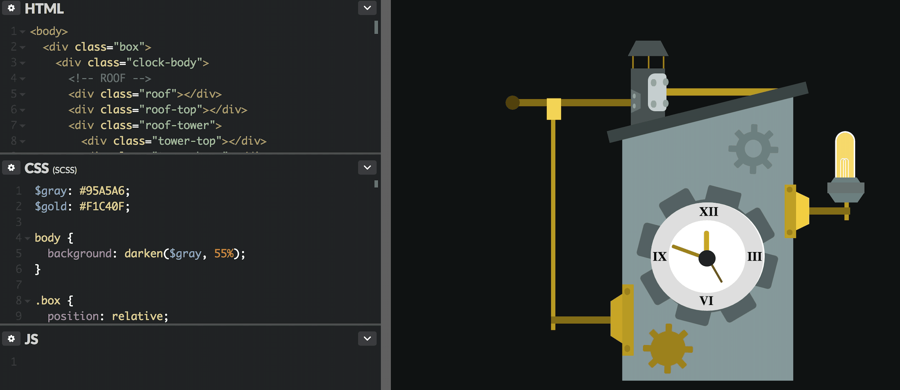
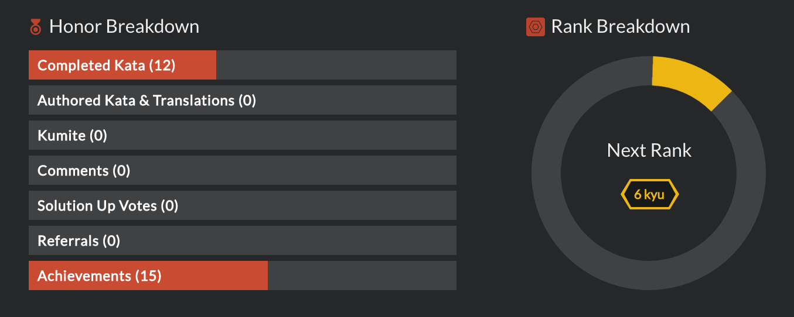
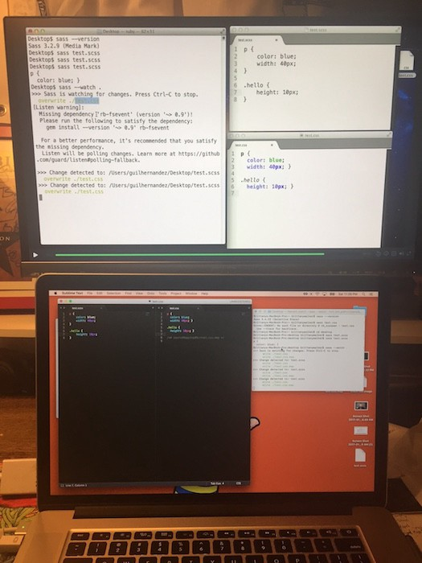
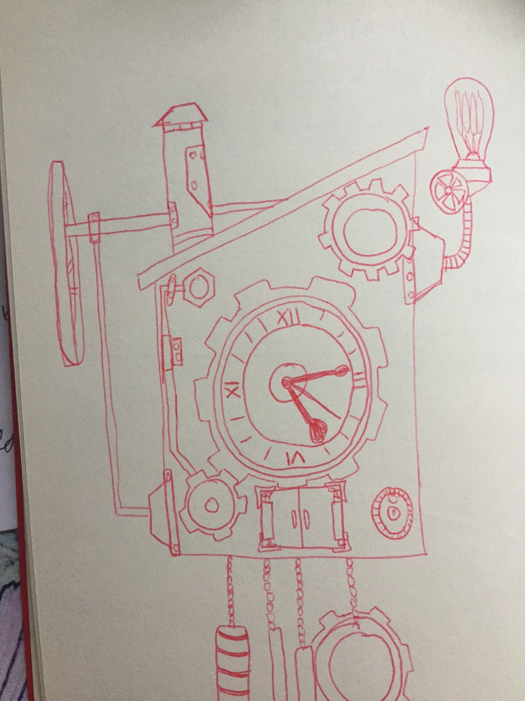
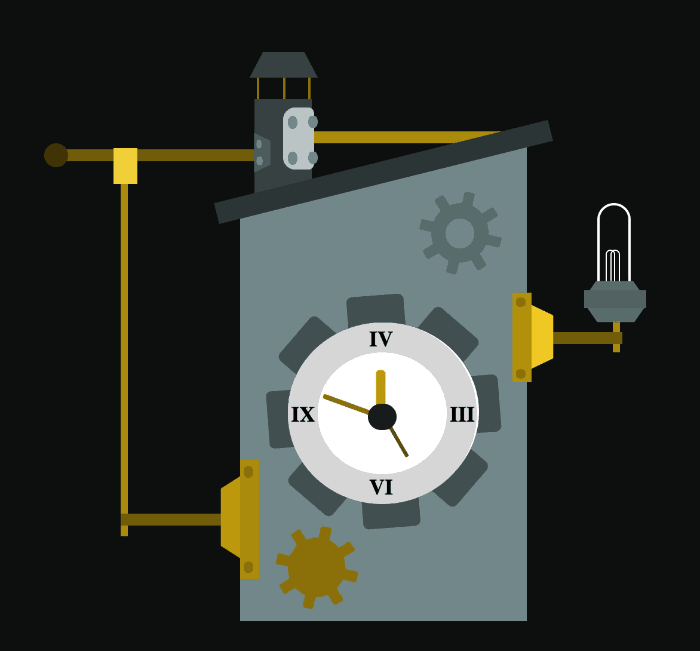
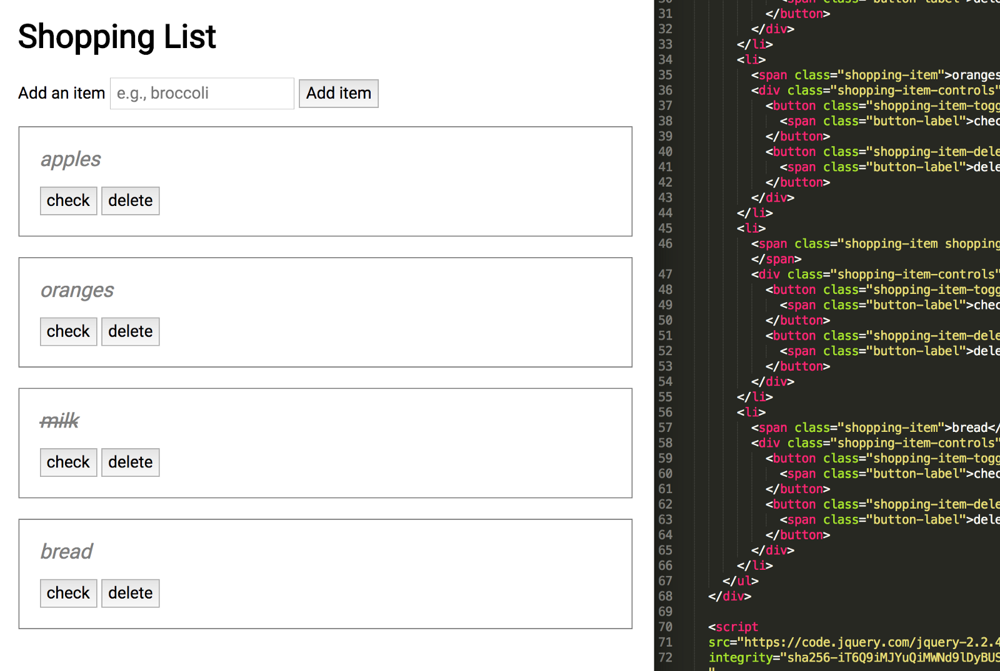

I am now in my third week of the 100 Days of Code Challenge. Below is a recap of everything that I accomplished during the past week.

> I started learning Sass, continued creating CSS images, studied jQuery and Javascript, started my Free Code Camp portfolio project and continued attending Meetups.

### Projects and Learning

**Learning Javascript & jQuery**

I am continuing to work on learning Javascript. And specifically arrays, objects and loops. After these exercises, I was able to actually complete Codewar challenges when last week all of the challenges seemed too difficult.

In addition to Javascript, I started learning jQuery. I worked on coding a text analyzer app that counts words and characters. I managed to get most of the required functions working but this week I will work on improving my code for the app.

**Learning Sass**

As I created CSS images, I realized that I was duplicating a lot of code and really needed to learn how to better condense and organize my CSS. This also became really clear after looking at other daily CSS image projects and seeing how others wrote their CSS. During the previous week, I had started to use Sass variables for colors but did not spend time learning any other aspects. This week I decided to focus on learning Sass so that I could make CSS images more quickly.

**CSS Images**

[Steampunk Clock Codepen Link](https://codepen.io/trekkiegirl/full/LxxQaG/)

I created one CSS image this week since I was focused on learning more Sass before continuing with them. The prompt was a clock and I created this Steampunk inspired clock with animations. This was my first time utilizing animations in a CSS image and I did utilize Sass variables for the colors. Originally I was going to create a cuckoo clock but decided to simplify it for the challenge.

**Portfolio Project**

I drew wireframes for my portfolio project and wrote the HTML for the basic structure. Now I am working on the mobile layout and design and how to transition it to the desktop layout which is fairly different.

### Meetups

I attended two Thinkful DC meetups this week. One was a hands on coding session and the other was an informational Q&A.

**Build a Web App with JavaScript & jQuery (Thinkful DC)**

At this meetup, we went through used jQuery and Javascript to create a shopping list app.

**Building Your Career In Tech (Thinkful DC)**

Two local web developers participated in a Q&A session about their learning journeys and their current jobs. Both developers came from non-programming backgrounds. It was really great to hear from local developers that are still fairly junior about how they learned programming, what a typical day entails as a developer and how they navigated the local job market.

### What’s Next?

1.  Continue working on my portfolio project.
2.  Try more difficult Codewars challenges.
3.  Catch up with daily CSS images. I am a week behind on images but now that I have learned more about Sass I think that I can create them faster and more efficiently going forward.
4.  And continue attending meetups!

To see my daily progress, follow me on Twitter [@musicalwebdev](https://twitter.com/musicalwebdev).
