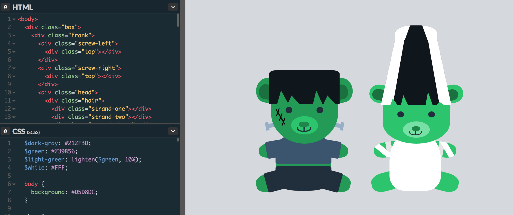
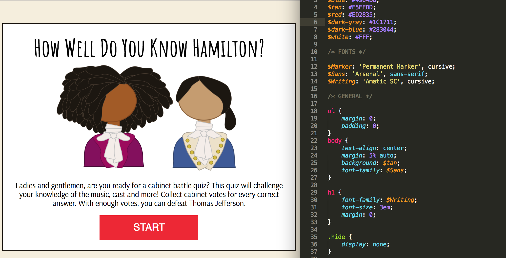
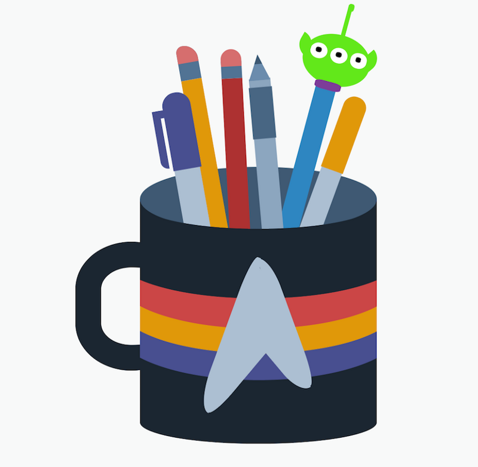
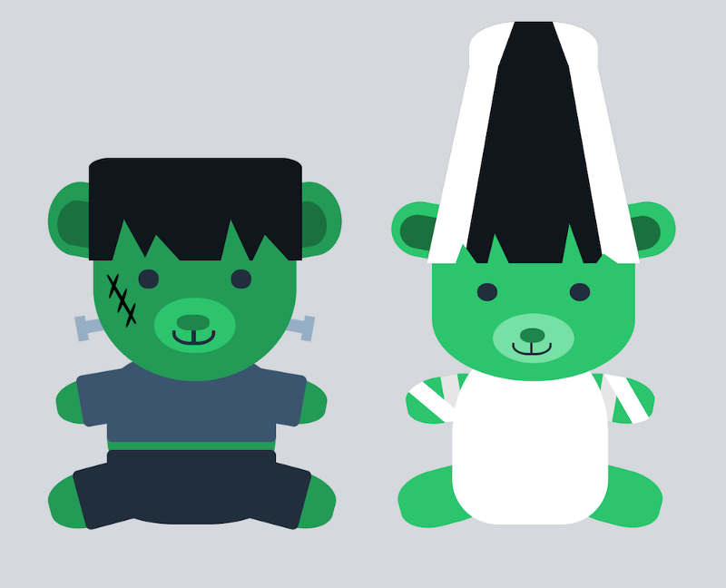
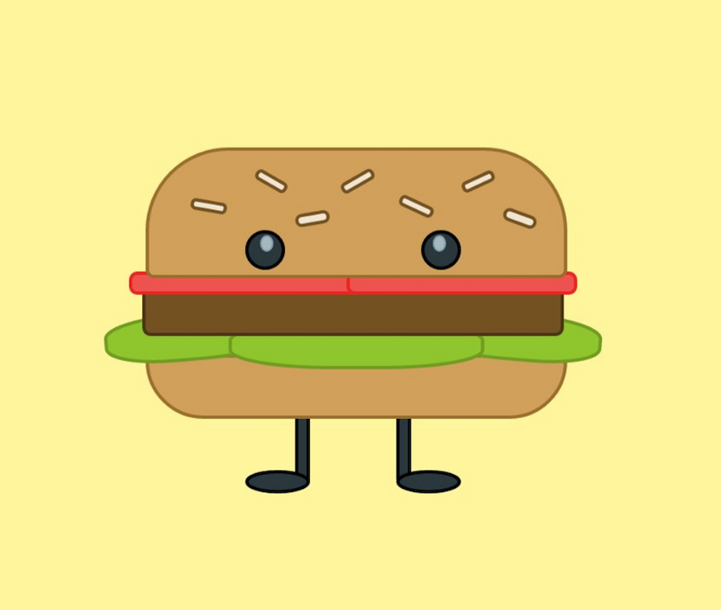

I have almost completed 30 days in the 100 Days of Code Challenge. Below is a recap of everything that I accomplished during the past week.

> Making progress on learning Sass, took a detour to brush up on Adobe Illustrator, created more CSS images, worked on a JavaScript quiz app and working on incorporating my love of musicals into projects.

### Projects

#### Quiz App

I have been working on a quiz app that utilizes jQuery and JavaScript. Right now, I have written the HTML and CSS and am working on figuring out the JavaScript. I’m sure you can guess what this quiz is about. _Hint: it’s Hamilton._ I spent a ton of time relearning Illustrator making vector images (I made that Jefferson and Hamilton above!) I plan on creating more images for this quiz.

#### CSS Images

This week I managed to create three more CSS images. I started to utilize more functions of Sass, especially in the Frankenstein pen. Though I still need to work on keeping it consistent and I need to learn other aspects such as mixins. I also need to work on making sure my code works for all browsers.

View the code here:

[CSS Pencil Jar Codepen Link](http://codepen.io/trekkiegirl/full/rjYGve/)

[CSS Frankenstein Codepen Link](http://codepen.io/trekkiegirl/full/mRpNqJ/)

[CSS Burger Codepen Link](http://codepen.io/trekkiegirl/full/apLvgx/)

#### Learning Sass & Adobe Illustrator

I am still working through the Treehouse Sass Basics course which has been really helpful in learning more about Sass. I also started the Treehouse Adobe Illustrator Illustrator foundations course so that I could make images, specifically for my quiz app. But I am also planning on creating illustrations for my portfolio project as well.

### Meetups

**Salary Negotiations for Web Developers (Thinkful DC)**

This was a great session about how salary negotiations work in the tech industry. There was also really great advice on how to make sure a job is right for you before you accept an offer.

**How to Use Version Control in Git and GitHub (Thinkful DC)**

At this meetup we went through some exercises on how to use the command line, such as making directories and files and then how to track changes with Git. We also talked about how branches worked, which was not something that I knew beforehand. Right now I am pretty comfortable with committing my own work to Github but since I have not worked on any group projects yet I am not as familiar with collaboration. This meetup helped with that knowledge gap.

**Building a Twitter Bot with Basic Python (Thinkful DC)**

At this meetup we learned how to build a twitter bot using Python. After the course, I looked at the code for the 100 Days Of Code Twitter bot on Github and actually could understand what some of it meant.

### What’s Next?

1.  Continuing with CSS images. I already have sketches for my next few images ready to go.
2.  Attend some other Meetups in the DC area over the next couple of weeks: Women Who Code, Code for DC, General Assembly, etc.
3.  Finish the quiz app.
4.  Complete HTML and CSS for mobile version of portfolio project.

To see my daily progress, follow me on Twitter [@musicalwebdev](https://twitter.com/musicalwebdev).
