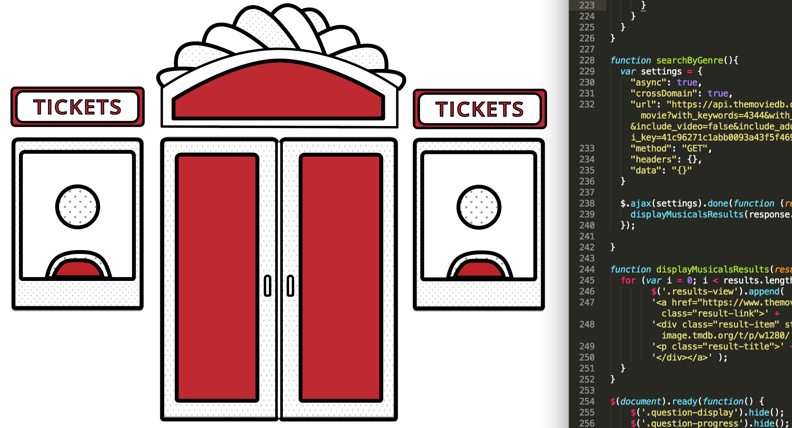
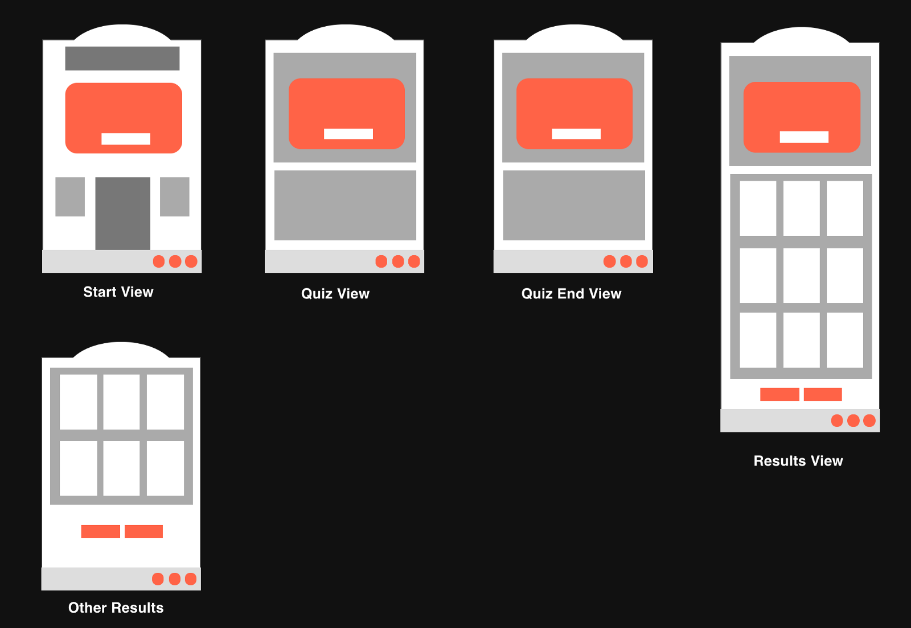
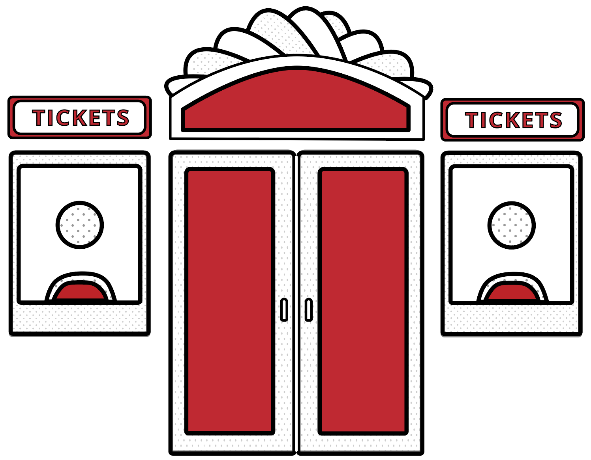

Below is a recap of everything that I accomplished during the past week (and a half).

> _Worked on an API project (musical related, of course), practiced with Illustrator and Sketch, worked on some Free Code Camp algorithms and started learning more about UI and UX design._

### Projects

#### API Project

I have been working on an API project for the past week with guidance from my mentor. Here is an outline of my process so far:

_Planning_

The first part of the assignment required a user flow chart and a sketched wireframe. The initial app idea was that the user would take a quiz and then receive a list of musicals based on their quiz responses. I also wanted the app to look like a theater in some way.

I also used [wireframe.cc](https://wireframe.cc/) to create some digital wireframes. After I figured out what views and pages I needed to create, I moved on to the API.

_API Research & Testing_

Unfortunately, there is really no API that included all of the information that I wanted. I tested out the [Ticketmaster](http://developer.ticketmaster.com/) and [Seat Geek](http://platform.seatgeek.com/) APIs, which both had information about current musicals, but also were missing other information that I wanted. I tried some other ideas, such as using lyrics from musicals to create something interesting (but [Genius](https://docs.genius.com/) doesn’t include lyrics in their API) or analyzing female comic book characters using [Comic Vine](http://comicvine.gamespot.com/api/)’s API.

So at this point I had read a lot of API documentation and still hadn’t decided which API I was going to use.

During a chat with someone about my project, they mentioned that when I said musicals, their first thought was **movies**. What if I focused on movie musicals instead? I checked the documentation for [The Movie Database](https://www.themoviedb.org/documentation/api) and…SUCCESS! TMDB had all of the keywords and genres that I needed for my project and their documentation was clear.

_Adding Javascript and Styling!_

After choosing an API, I wrote the HTML and some simple CSS for my project. I then confirmed that I could retrieve the information that I wanted from the API and started adding in Javascript starting with the start button, then adding the quiz functions and so on.

Once the app was pulling in the correct information and displaying it, I started on styling. This is the step that I am on now. I have decided on a white, black, red color scheme and am in the process of creating some simple illustrations for the app.

#### CSS Images

This week I made a quick CSS image of a pie.

### Learning

In addition to projects, I spent some time learning new concepts this week:

1.  I worked on a few Free Code Camp Javascript algorithms.
2.  I started to play around with Sketch and competed a few Adobe Illustrator tutorials to refresh my knowledge of the program.
3.  I have also learned more about UI and UX design via Youtube videos, tutorials, books and so on.

### Meetups

**Getting Started With Developer Tools (Thinkful DC)**

At this meetup, we learned how to utilize the Chrome developer tools more efficiently. Some of the most useful features we focused on were the device toggle, how to save changes made in the dev tools to your local files and how to optimize using the network panel.

**Career Lab (General Assembly DC)**

On a Saturday, General Assembly hosted a Career Lab event. There were various sessions you could attend to learn about specific design and tech fields. The sessions included Data Science, Negotiation 101, Javascript, Coding, Design Thinking and so on. My favorite session was UX Design. The session began with an overview of UX design and then focused on user research, specifically interviewing. Overall it was a great event!

**An Introduction to Software Testing (Thinkful DC)**

At this meetup, we learned some testing methods developers can use to test the functionality of their websites and apps.

### What’s Next?

1.  Finish my API project!
2.  Continue with CSS images and start with UI daily challenges.
3.  Continue attending meetups.

To see my daily progress, follow me on Twitter [@musicalwebdev](https://twitter.com/musicalwebdev).

To view my 100 days of code repo visit [my Github](https://github.com/brittanyrw).
