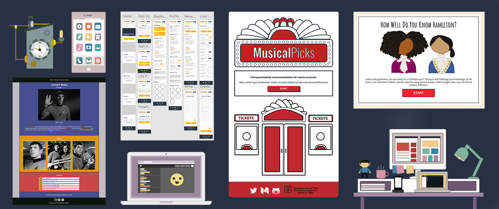

I completed the 100 Days of Code Challenge where I spent at least one hour coding for 100 days (in a row!!!). I originally started learning to code this year because I wanted to be able to customize the design of a blog I wanted to create. Now I’m hooked! Below is a recap of everything I have accomplished during the past 100 days.

### What I Learned

I started the challenge with some beginner knowledge in CSS and HTML. Now I have the ability to build complex web applications. Below is an outline of some of the various frameworks, tools and languages that I learned during the challenge.

**HTML** (Slim, Pug)

**CSS** (Sass, Neat, Flexbox)

**JavaScript** (Vue.js, Node.js, jQuery)

**Tools & Backend** (Git, Github, MongoDB, REST APIs, Heroku)

**Testing** (Test Driven Development, Travis CI, Postman)

**Design** (Mobile First Design, Wireframing, Adobe XD, Illustrator, Photoshop, Sketch, Affinity Designer)

### What I Created

#### CSS Images

One of my favorite projects was the [Daily CSS Image Challenge](http://challenges.codingartist.io/daily-css-images/), which was created by [Michael Mangialardi](https://twitter.com/michaelmangial1). You sign up via email and receive prompts each weekday such as bear cub, keyboard, and so on, and are challenged to create a CSS image inspired by the prompt. You can [take this free course created by Michael](https://coding-artist.teachable.com/p/how-to-make-pure-css-images) to learn how to make CSS images.

\*note: GIFs might take a minute to load.

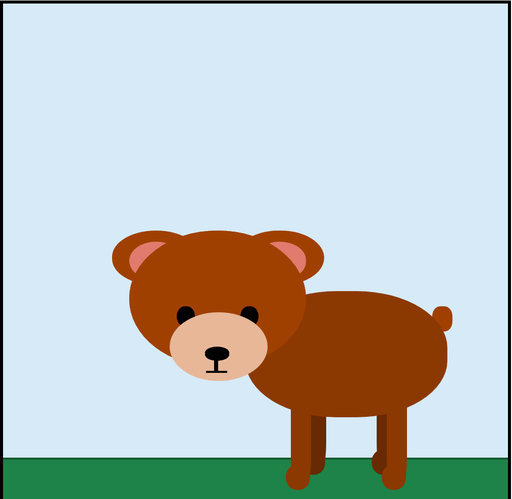

#### First CSS image (bear cub) vs one of the latest animated images (cat phone)

#### Highlighted CSS Images

In addition to the Cat iPhone above, here are more of my favorite CSS images.

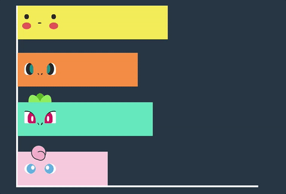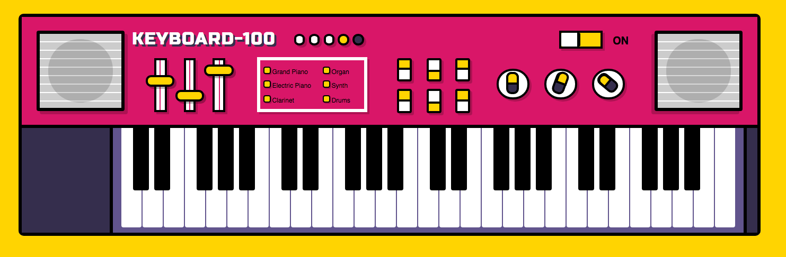

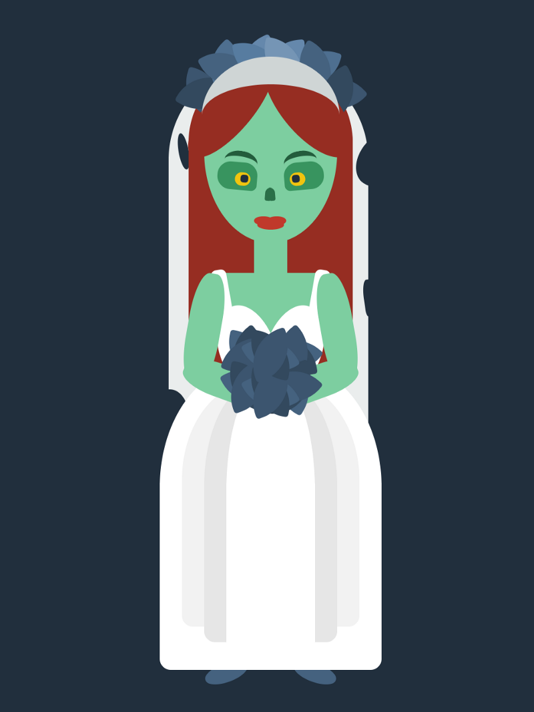

#### Additional CSS Images

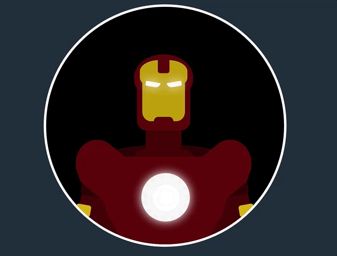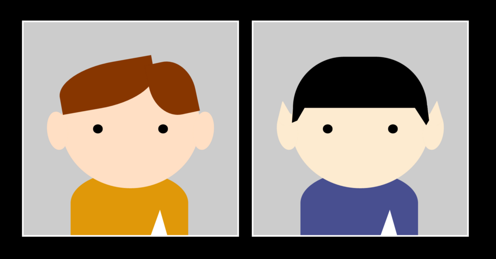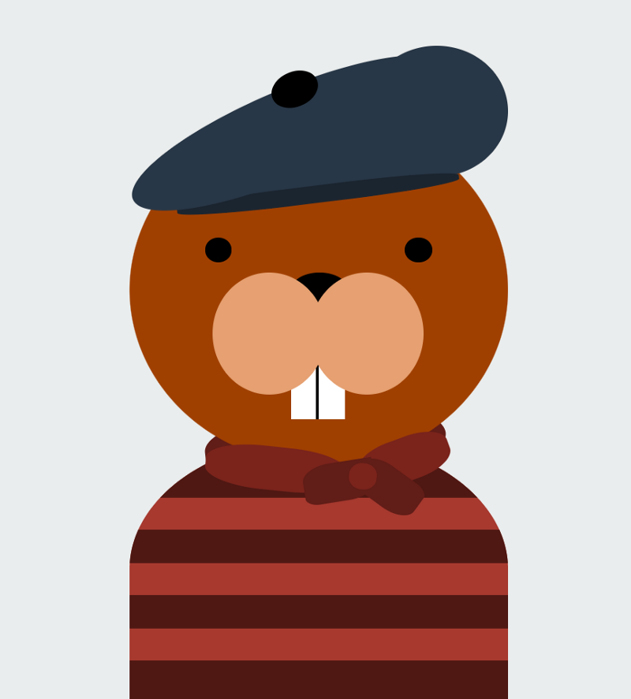

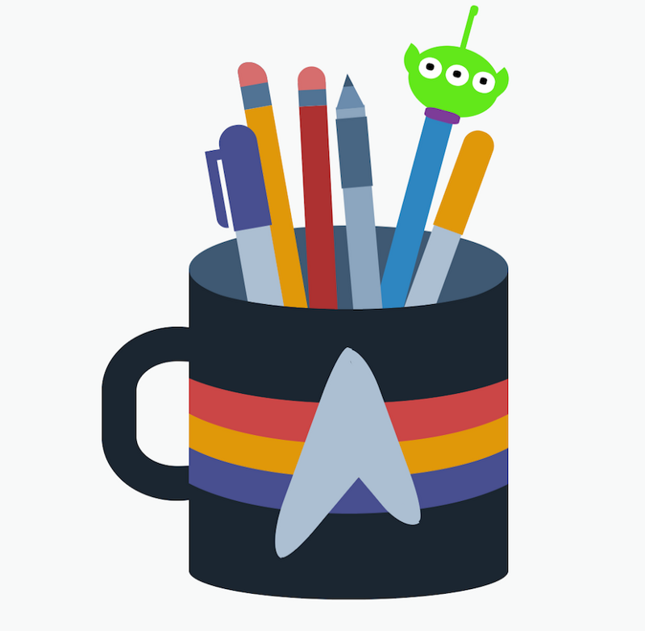

[You can view all of my CSS images at CodePen](http://codepen.io/trekkiegirl).

#### Projects

I completed quite a few projects during the challenge. Below are some of the highlights.

#### MusicalPicks

Take a short quiz to receive movie musical recommendations. This app utilizes The Movie Database API and was built with jQuery/Javascript, Sass and illustrations created in Illustrator.

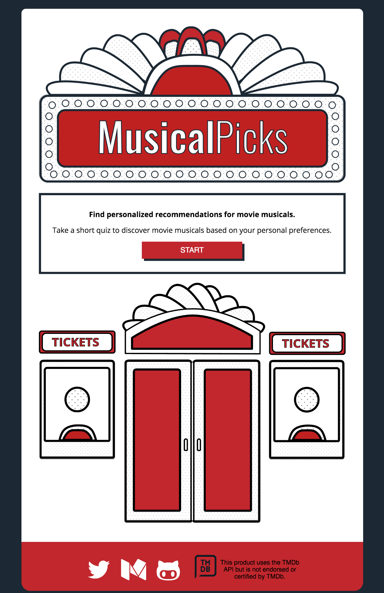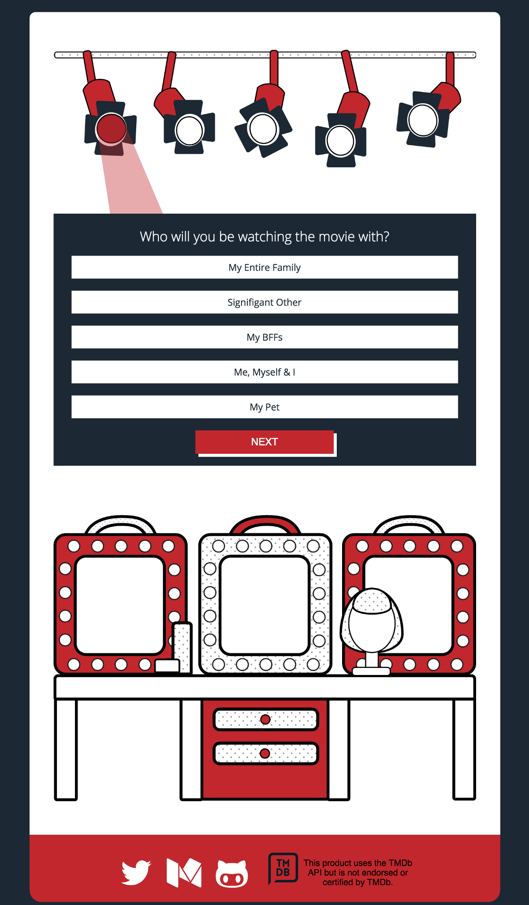

[Demo MusicalPicks Here](http://www.brittanywalker.io/musicalpicks/)

#### Hamilton Quiz App

A simple quiz app about Hamilton the Musical. Created using jQuery, Sass and illustrations created in Illustrator.

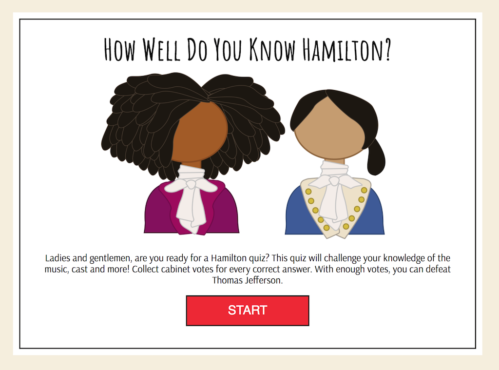

[Demo the Hamilton Quiz Here](http://www.brittanywalker.io/hamilton-quiz-app/)

#### Quote Machine

Random inspirational quotes for women project created for Free Code Camp.

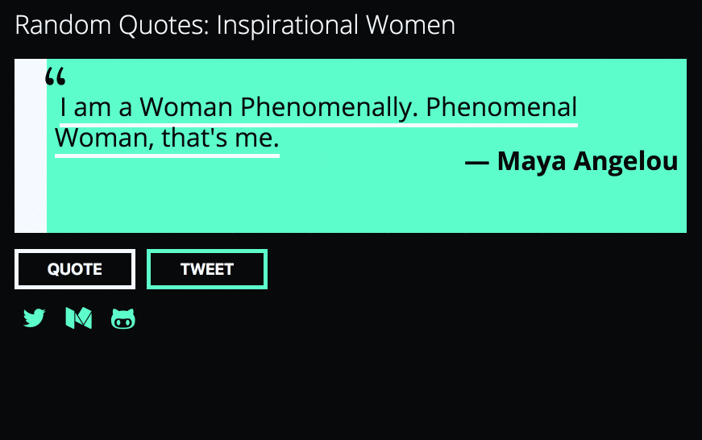

[Demo the Random Quote Machine Here](http://www.brittanywalker.io/free-code-camp-random-quotes/)

#### Free Code Camp Tribute Page

Tribute page to Leonard Nimoy for Free Code Camp.

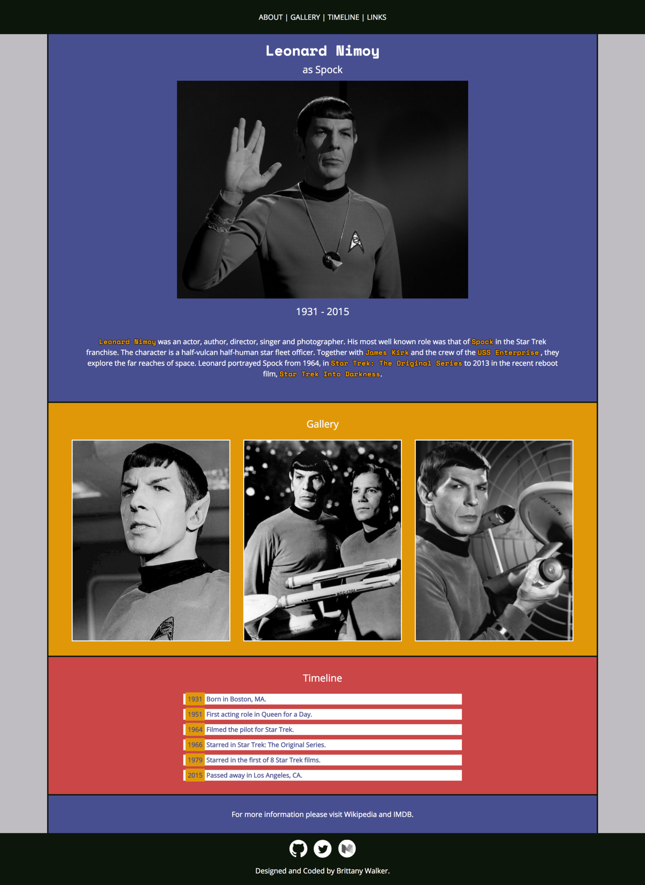

[Demo the Leonard Nimoy Tribute Page Here](http://www.brittanywalker.io/free-code-camp-tribute-page-v2/)

**Current Projects**

I am currently in the middle of creating my first Node project (screenshot of some of the wireframes are in the header image). More information to come soon!

#### Meetups

I attended a ton of Meetups the past 100 days. Here is a list of some of the Meetups I attended:

Introduction to JavaScript

Ruby on Rails: Beginners Night!

Build a Game with JavaScript

Build a Web App with JavaScript & jQuery

How to Use Version Control in Git and Github

Build a Twitter Bot with Basic Python

Getting Started with Developer Tools

An Introduction to Software Testing

Shortcuts and Automation: How to Develop Like a Pro

Design for Developers

Intro to Git

Getting Started in Data Science

Intro to Data Science with Python: Predict the Oscars

### Favorite Resources

And finally, here are a list of some of my favorite resources.

[Daily UI](http://www.dailyui.co/)

[JavaScript 30](https://javascript30.com/)

[Mackenzie Child](https://www.youtube.com/user/mackenziechild) — Product designer and Illustrator. He creates videos about design and illustration, as well as Webflow. He has a live stream series called Watch Me Practice where you can observe him designing in Illustrator.

[The Futur](https://www.youtube.com/user/TheSkoolRocks) — This channel is hosted by Chris Do, who is a designer. Topics range from freelancing tips to portfolio critiques.

[The Net Ninja](https://www.youtube.com/channel/UCW5YeuERMmlnqo4oq8vwUpg) — This is a great channel to view for all types of coding tutorials from CSS animation tutorials to REST API tutorials.

### The result?

(Updated Jan 2018)

To see my daily progress, follow me on Twitter [@musicalwebdev](https://twitter.com/musicalwebdev).
