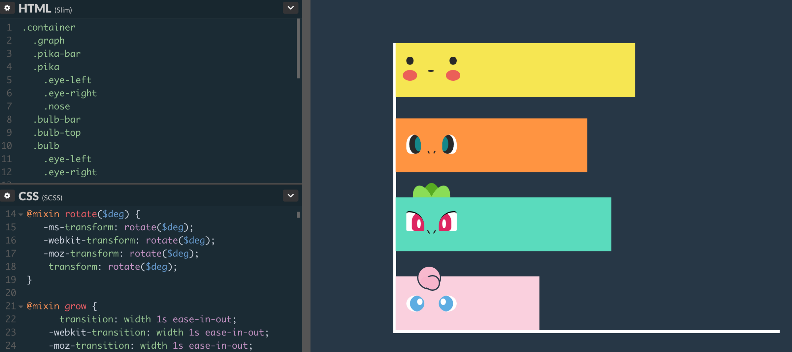
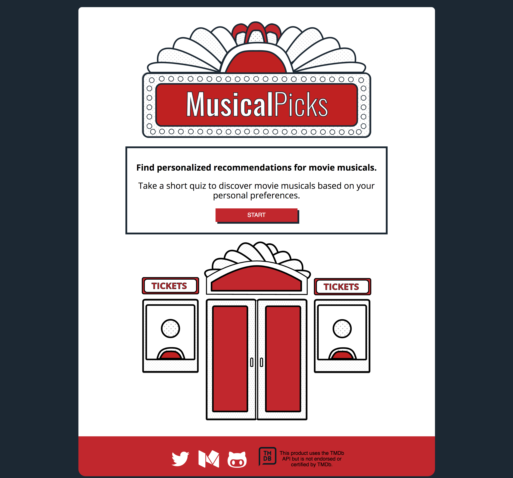
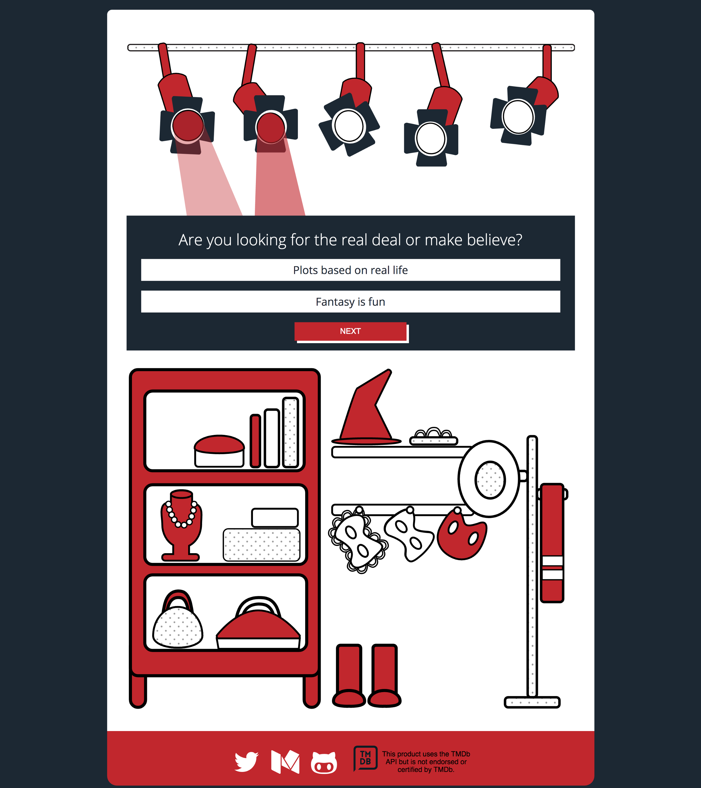
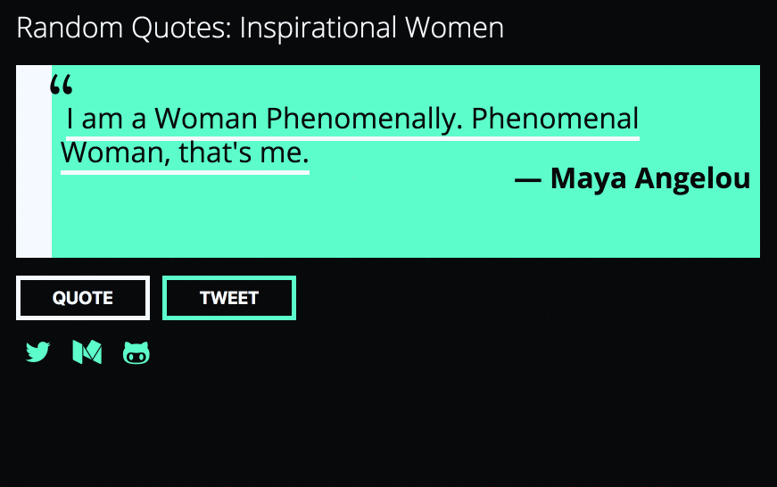
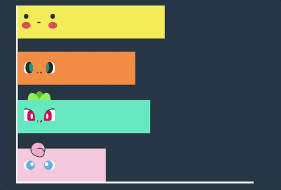
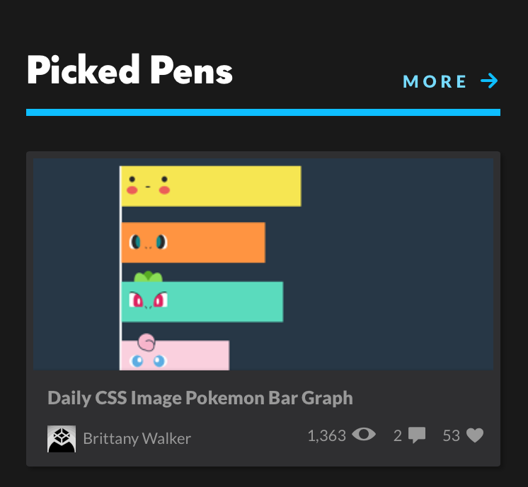
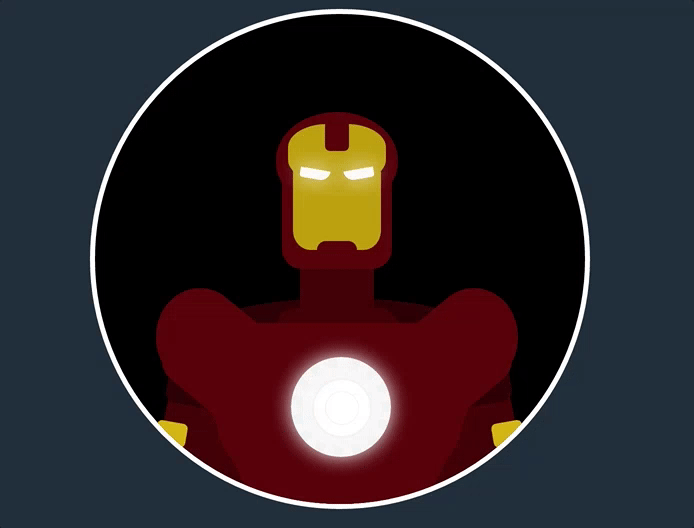
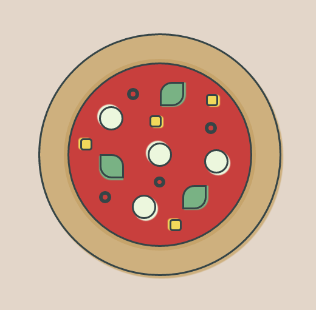

Below is a recap of everything that I accomplished during the past two weeks.

> A lot of progress! Created more CSS images, finished first big project, learned about SVG and animations, worked on Free Code Camp projects, learned about UI and UX design and started to learn Node.js.

### Projects

I managed to knock out two projects the past two weeks and I have started planning my next one. I was able to utilize a lot of things I have learned in regards to UI and design.

#### API Project — MusicalPicks

This project uses The Movie Database API to pull information about movie musicals. The user takes a short five question quiz to determine what genres they prefer and then is presented a list of musicals based on those genres. Users can also search musicals by genre after the quiz has been completed if they would like to see more options.

For this project, I wanted the app to look like a theater. I created a few illustrations in Adobe Illustrator to create this effect. The illustrations include a title sign designed to look like a theater marquee, a home page illustration of the front door and box office of a theater, an illustration of a dressing room, an illustration of a prop or costume storage as well as theater lights.

To show users their progress through the quiz, I created an illustration of theater lights where each light will light up to show you what number question you are on. Below is a screenshot of the second quiz question.

[Demo MusicalPicks here](https://brittanyrw.github.io/musicalpicks/)

[View the Github repo here](https://github.com/brittanyrw/musicalpicks)

#### Free Code Camp — Random Quote Generator

I also finished the Free Code Camp random quote project. I kept the design simple and decided to go with an inspirational women theme. For this project, I decided not to utilize an API and listed quotes that I selected in an object instead.

[Demo the Random Quote Generator here](https://brittanyrw.github.io/free-code-camp-random-quotes/)

[View the Github repo here](https://github.com/brittanyrw/free-code-camp-random-quotes)

#### CSS Images

Pokemon bar graph with hover animation for ‘bar graph’ prompt.

[View the Pokemon Bar Graph on Codepen](https://codepen.io/trekkiegirl/full/QdeLqy/)

The bar graph was also featured in Codepen’s Picked Pens!

Iron Man with animated arc reactor for ‘Iron Man’ prompt.

[View Iron Man on Codepen](https://codepen.io/trekkiegirl/full/JEgXdr/)

Simple flat pizza for ‘pizza’ prompt.

[View Pizza on Codepen](https://codepen.io/trekkiegirl/full/NpKPYL/)

#### SVG Images

I also have started the SVG image daily challenge. The first prompt was to create Toad from Mario. I created this image using Affinity Designer and used CSS for the animation.

[View Toad on Codepen](https://codepen.io/trekkiegirl/full/MpgdVK/)

### What’s Next?

1.  Planning portfolio. I need to create a portfolio since I don’t plan on using the Free Code Camp portfolio that I created as my official portfolio. I will start wireframing and brainstorming.
2.  Learn more about Node.js.
3.  Attend meetups. I plan to attend around 9 meetups in the month of March.
4.  Continue with CSS images, SVG images and learning UI/UX.

To see my daily progress, follow me on Twitter [@musicalwebdev](https://twitter.com/musicalwebdev).

To view my 100 days of code repo visit [my Github](https://github.com/brittanyrw).
