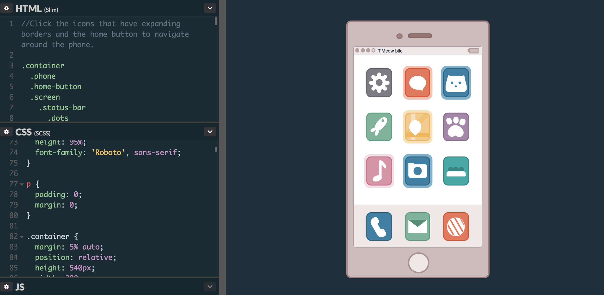
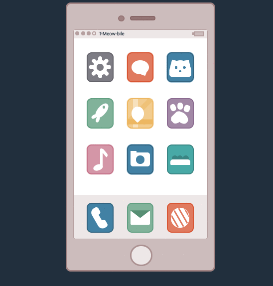
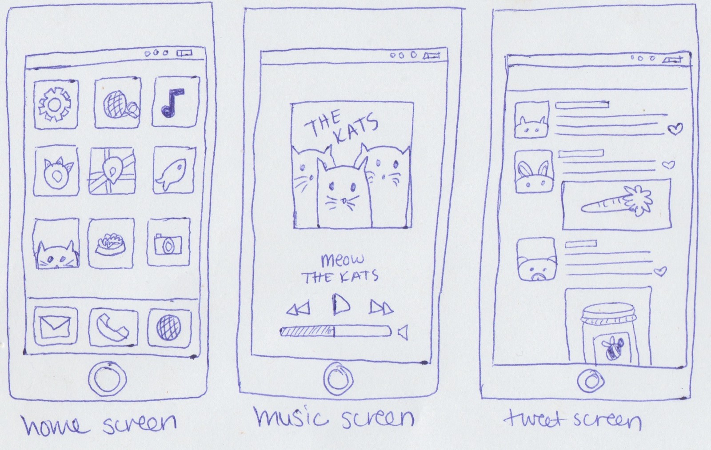
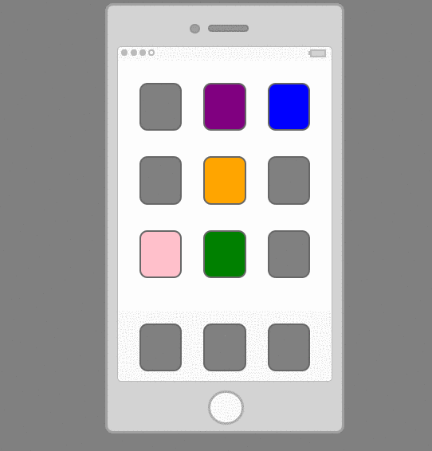
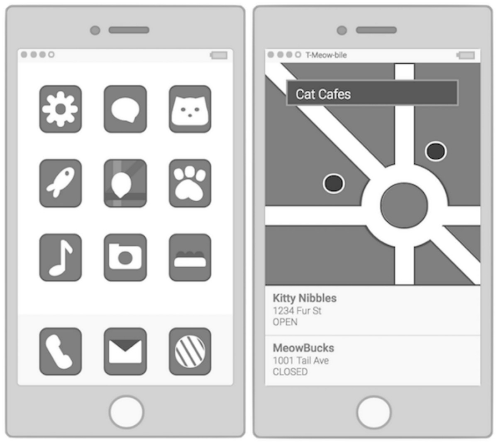
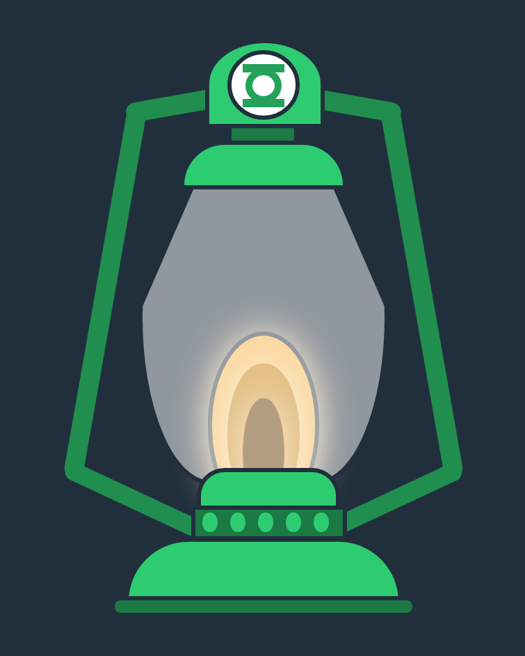
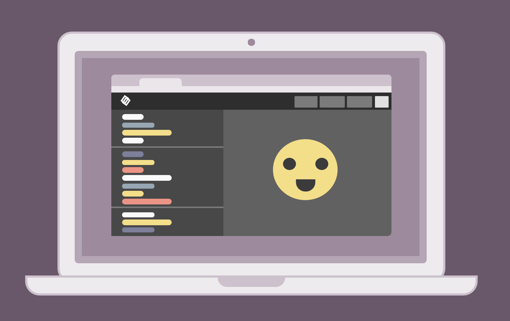

Below is a recap of everything that I accomplished during the past two weeks.

> Created more CSS images, started planning my next big project, worked on Free Code Camp projects and continued to learn Node.js.

### Projects

#### CSS Images

Over the past week and a half I created three CSS images. My favorite was for the ‘cell phone’ prompt. I decided to create an interactive cat themed phone to make it a little more interesting. Users can navigate through the phone by clicking on the images to bring up screens and clicking on the home button to return to the home screen. Since I did not make a screen for every icon, I created an animation to indicate which icons are clickable. Every image in the app was created using CSS.

[View Interactive Cat Phone on Codepen](https://codepen.io/trekkiegirl/full/ZeLBMW/)

This project required a lot of planning. Before coding, I sketched out potential screens and icon ideas.

After I decided on the theme and most of the illustrations for the phone, I coded a grayscale prototype.

The prototype was created to test the jQuery animations for bringing up the screens that correspond with with each icon. I matched the colors on the icons correspond with the background colors of the screens to verify that they were working correctly.

After confirming that the animations worked, I wrote the code for the rest of the CSS images (icons and screens). At this point I continued using various shades of grays because I knew this image would include many colors and found that its easier to match colors after all of the images are in place.

I also created two additional CSS images. One was for a Green Lantern (the superhero) prompt and the other was for a laptop.

[View “Green Lantern” on Codepen](https://codepen.io/trekkiegirl/full/yMJYRZ/)

[View Laptop on Codepen](https://codepen.io/trekkiegirl/full/ZeONRJ/)

### Learning

I started planning my weather API project for Free Code Camp. I will be using CSS images for weather icons. I also completed all of the FCC basic Javascript algorithms. I also continued learning Node.js and am planning a project that will utilize Node.

### Meetups

**Shortcuts and Automation: How to Develop Like a Pro (Thinkful DC)**

At this meetup we went through a ton of useful Sublime keyboard shortcuts. We also went over Terminal shortcuts and tips for how to improve your workflow.

### Podcasts

I started listing to Code Newbie and Software Engineering Daily podcasts, which I highly recommend. Below are some podcasts that I listened to during the past two weeks:

[Open Source Contribution with Shubheksha Jalan (Software Engineering Daily)](https://softwareengineeringdaily.com/2017/02/07/open-source-contribution-with-shubheksha-jalan/)

[Getting My First Developer Job — Paola Mata (Code Newbie)](http://www.codenewbie.org/podcast/getting-my-first-developer-job)

### What’s Next?

1.  Build my portfolio. I have decided on a layout and now I plan on creating a mockup in Sketch, chose the colors and finally code it.
2.  Learn more about Node.js.
3.  Attend meetups.
4.  Continue with CSS images, SVG images and learning UI/UX. I want to start using Sketch more and continue making vector images in Affinity Designer.

To see my daily progress, follow me on Twitter [@musicalwebdev](https://twitter.com/musicalwebdev).

To view my 100 days of code repo visit [my Github](https://github.com/brittanyrw).
